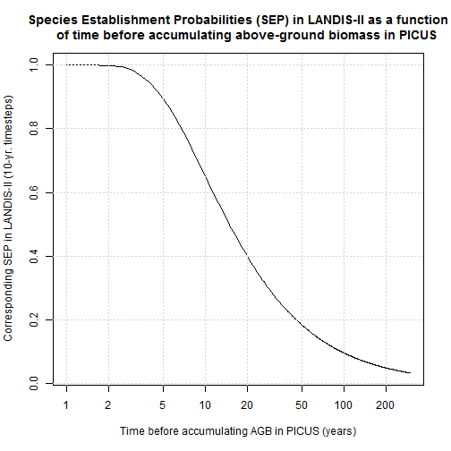

# CodeBook for *PicusToLandisSEP.R*

This is an R Markdown document. Markdown is a simple formatting syntax for authoring HTML, PDF, and MS Word documents. For more details on using R Markdown see <http://rmarkdown.rstudio.com>.

## General description

This is documentation for [*PicusToLandisSEP.R*](http://github.com/dcyr/Landis-II-SCF/blob/master/PicusToLandisSEP.R), which yields species establishment probabilities (**SEP**) from previously formatted PICUS outputs.

- **SEP** is the probability of a cohort to successfully establish on a site during one time step, given that seeds reach it and that light conditions are adequate. It can range from 0 to 1.

More details about this parameter, how it participate to succession as simulated by LANDIS-II and how it interact with each other, are available in [Scheller et al. 2004](http://landscape.forest.wisc.edu/PDF/Scheller_Mladenoff2004_EM.pdf), as well as in the latest [Biomass Succession documentation](http://www.landis-ii.org/extensions/biomass-succession) for an updated version.

## Primary input
A data table *picusOutputsDF.csv* produced by the script [*PicusOutputsToDF.R*](http://github.com/dcyr/Landis-II-SCF/blob/master/PicusOutputsToDF.R), which contains all necessary information to compute **SEP**, for every combinations of species and landtypes. That .csv file may contain information from one or more study area, climate scenario, and period.

The location of *picusOutputsDF.csv* must be specified and can be assigned to variable **processedDir**.


```r
summary(picusOutputsDF)
```

```
##  ecozone           scenario            period           landtype      
##  BSE:2070590   Baseline: 302406   20112040: 360987   4225   :  28182  
##                RCP26   : 365246   20412070: 363716   4205   :  28154  
##                RCP45   : 363440   20712100:1043481   4223   :  28107  
##                RCP85   :1039498   Baseline: 302406   4175   :  28102  
##                                                      4413   :  28066  
##                                                      4011   :  27999  
##                                                      (Other):1901980  
##                 species             Year      BiomassAbove_kg_ha
##  Pinus_banksiana    : 142200   Min.   :2000   Min.   :     0    
##  Betula_papyrifera  : 139394   1st Qu.:2075   1st Qu.: 35933    
##  Populus_tremuloides: 138847   Median :2150   Median : 81325    
##  Thuja_occidentalis : 137709   Mean   :2150   Mean   : 77241    
##  Pinus_strobus      : 136786   3rd Qu.:2225   3rd Qu.:110892    
##  Pinus_resinosa     : 136691   Max.   :2299   Max.   :388526    
##  (Other)            :1238963                                    
##  DiedBiomassAbove_kg      anpp      
##  Min.   :    0       Min.   :-6185  
##  1st Qu.: 1784       1st Qu.: 1552  
##  Median : 3305       Median : 3423  
##  Mean   : 3432       Mean   : 3682  
##  3rd Qu.: 4780       3rd Qu.: 5085  
##  Max.   :28266       Max.   :95158  
## 
```

### Seconday input
A few additionnal information contained in *vegCodes.csv* allows for a smoother processing of multiple species and simulation areas. That table contains the scientific names, common names, LANDIS names, etc., and the species to include in each simulation areas (as binary variables).

```r
head(vegCodes)  ### first lines of table 'vegCodes.csv'
```

```
##   Code      Common.name                    Scientific.name Farrar.1995.
## 1  100           Spruce                              Picea           95
## 2  101     Black spruce          Picea mariana (Mill.) BSP          106
## 3  102       Red spruce                 Picea rubens Sarg.          104
## 4  103  Norway spruce *            Picea abies (L.) Karst.          108
## 5  104 Engelmann spruce Picea engelmannii Parry ex Engelm.          100
## 6  105     White spruce         Picea glauca (Moench) Voss          102
##   Life.form Code_LANDIS Veg_rep    PICUS_name BSE
## 1      <NA>        <NA>      NA          <NA>   0
## 2     ST-MT    PICE.MAR       0 Picea_mariana   1
## 3        MT    PICE.RUB       0  Picea_rubens   0
## 4        LT        <NA>      NA          <NA>   0
## 5 LT (-VLT)    PICE.ENG       0          <NA>   0
## 6        MT    PICE.GLA       0  Picea_glauca   1
```


## Primary ouput
A structured R list *pEST.RData*  containing the extracted SEPs. Its hierarchical structure should facilitate the use of loops in downstream analysis.

That object is saved in the folder **wwd**, and overwrite any existing file of the same name. A new folder is generated one is generated every day using current date.


## Methodological details

We assume that SEP for LANDIS-II is directly linked with the time necessary to accumulate aboveground in biomass in PICUS. That interval is sensitive to climate and soil.
We thus take the time necessary to accumulate aboveground biomass (tbb), and suppose that the probability of establishment at any time step in LANDIS-II is equal 1/tbb.

Then, we consider the establishment of a cohort as a Bernouilli trial conducted every year during a time step. If the time step is 10 years, we compute the probability of having more than zero success (1 or more) in 10 consecutive trials.

The SEP varies as a function of time before accumulating biomass as followed: 


```r
x <- seq(from=1, to=300, by=0.5)
y <- pbinom(q=0, size=10, prob=1/x, lower.tail=FALSE)
plot(x, y, log="x", type="l",
     main="Species Establishment Probabilities (SEP) in LANDIS-II as a function
     of time before accumulating above-ground biomass in PICUS", 
     xlab="Time before accumulating AGB in PICUS (years)",
     ylab="Corresponding SEP in LANDIS-II (10-yr. timesteps)")
  grid(equilogs=FALSE)  
```

 


