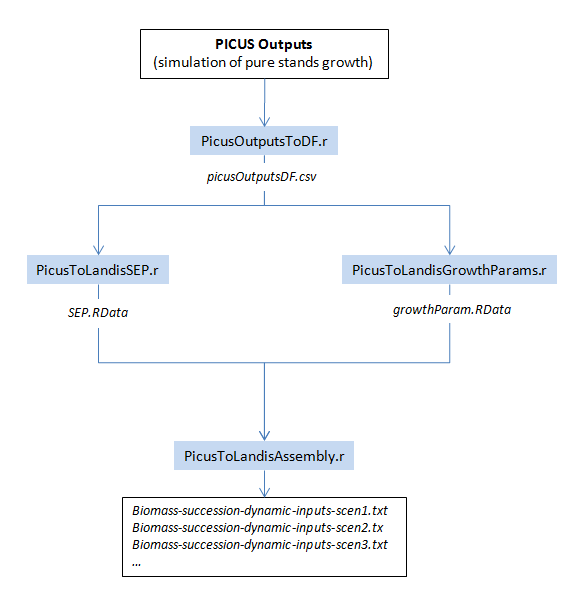

# Picus outputs to LANDIS-II Biomass Succession dynamic inputs
Dominic Cyr  
Updated on Mar 13 2017

-------

## General description

[PICUS][3] is an individual-based spatially explicit tree growth model mainly used for simulating stand-level forest dynamics. We use Picus outputs to derived parameters to be used with [LANDIS-II][1], another spatially explicit forest model designed for landscape-level applications.

In this repository you will find R scripts that allow to generate [LANDIS-II][1]'s [Biomass Succession extension][2] dynamic inputs from the ouputs of stand-level forest simulator [PICUS][3].

-------

## Landis-II Biomass succession dynamic inputs

If you're not interested in the details but want to visualize what those sets of parameters look like, click on one of the links below. The following items are available for every active landscape:

+ Distribution of parameter values among land types
    + Maximum annual aboveground biomass (maxAGB)
    + Maximum annual net primary productivity (maxANPP)
    + Species establishment probability (SEP)
+ Picus simulations raw outputs (Pure stand growth - Aboveground biomass)

### Simulated landscapes

+ Forest Change - Integrated Assessment (chap. 4)
    + [Atlantic Maritime][13]
    + [Boreal Shield East][14]
    + [Boreal Shield West][15]
    + [Boreal Plain][16]
    + [Montane Cordillera][17]
    + [Pacific Maritime][20]
    + [Boreal Cordillera][21]
    
+ CBFA Project
    + [Lac Saint-Jean][18]
    + [Western Ontario][19]
    + [Sud Saint-Laurent][22]
    + [Alberta - Pacific][23]
    + Manitoba - Saskatchewan (coming soon)

+ Acadian Forest Project
    + [Acadian][12]

-------

## From Picus to Landis-II - Biomass succession 

One of the current study's objective is to emulate species growth as simulated by PICUS, upscale it to landscape level using LANDIS-II, and integrate processes that occur at those scales such as fire, seed dispersal, and landscape-level forest management, etc.

More specifically, that involves fetching PICUS outputs, passing them to a first script that format those into a tidy .csv file, which is then used to generate Species Establishment Probabilities (__SEP__) and growth parameters (__maxANPP__ and __maxAGB__). Those parameter set are then finally assembled into the appropriate format for LANDIS-II, according to user-specified scenarios.

The scripts allow to automate the processing of multiple species, climate scenarios, periods, and simulation areas at once.

Note that some secondary (required) inputs and optional are not shown on this figure.

More details about each steps can be found in the markdown files (.md) that are associated with each script.

+ [PicusOutputsToDF.R][4] allow to process PICUS outputs in batch and yields a tidy data table to be used as input in downstream steps of the pipeline. Description [here][5].
+ [PicusToLandisSEP.R][6] yields Species Establishment Probabilities (SEP) from previously formatted PICUS outputs. Description [here][7]
+ [PicusToLandisGrowthParam.R][8] yields growth parameters (**maxANPP** and **maxAGB**) from previously formatted PICUS outputs. Description [here][9].
+ [PicusToLandisAssembly.R][10]. takes the information contained in *growthParam.RData* and *pEst.RData*, produced by [PicusToLandisGrowthParam.R][8] and [PicusToLandisSEP.R][6], respectively, and format them into .txt files ready to be used as [LANDIS-II][1] [*Biomass Succesion*][2] dynamic inputs. Description [here][11].

## References

More details about those parameters, how they interact with each other, and how the allow for the emergence of succession as simulated by **LANDIS-II - Biomass succession** , are available in [Scheller et al. 2004](http://landscape.forest.wisc.edu/PDF/Scheller_Mladenoff2004_EM.pdf), as well as in the latest [Biomass Succession documentation](http://www.landis-ii.org/extensions/biomass-succession) for an updated version.

[1]: http://www.landis-ii.org/
[2]: http://www.landis-ii.org/extensions/biomass-succession
[3]: http://www.wabo.boku.ac.at/en/waldbau/forschung/fachgebiete/waldoekosystemmodellierung/dynamische-oekosystemmodelle/picus/
[4]: http://github.com/dcyr/Landis-II-SCF/blob/master/PicusOutputsToDF.R
[5]: http://github.com/dcyr/Landis-II-SCF/blob/master/PicusOutputsToDF.md
[6]: http://github.com/dcyr/Landis-II-SCF/blob/master/PicusToLandisSEP.R
[7]: http://github.com/dcyr/Landis-II-SCF/blob/master/PicusToLandisSEP.md
[8]: http://github.com/dcyr/Landis-II-SCF/blob/master/PicusToLandisGrowthParam.R
[9]: http://github.com/dcyr/Landis-II-SCF/blob/master/PicusToLandisGrowthParam.md
[10]: http://github.com/dcyr/Landis-II-SCF/blob/master/PicusToLandisAssembly.R
[11]: http://github.com/dcyr/Landis-II-SCF/blob/master/PicusToLandisAssembly.md
[12]: https://github.com/dcyr/PicusToLandisIIBiomassSuccession/blob/master/paramViz/ParamDistribution_Acadian.md
[13]: https://github.com/dcyr/PicusToLandisIIBiomassSuccession/blob/master/paramViz/ParamDistribution_AM.md
[14]: https://github.com/dcyr/PicusToLandisIIBiomassSuccession/blob/master/paramViz/ParamDistribution_BSE.md
[15]: https://github.com/dcyr/PicusToLandisIIBiomassSuccession/blob/master/paramViz/ParamDistribution_BSW.md
[16]: https://github.com/dcyr/PicusToLandisIIBiomassSuccession/blob/master/paramViz/ParamDistribution_BP.md
[17]: https://github.com/dcyr/PicusToLandisIIBiomassSuccession/blob/master/paramViz/ParamDistribution_MC.md
[18]: https://github.com/dcyr/PicusToLandisIIBiomassSuccession/blob/master/paramViz/ParamDistribution_LSJ.md
[19]: https://github.com/dcyr/PicusToLandisIIBiomassSuccession/blob/master/paramViz/ParamDistribution_WestON.md
[20]: https://github.com/dcyr/PicusToLandisIIBiomassSuccession/blob/master/paramViz/ParamDistribution_PM.md
[21]: https://github.com/dcyr/PicusToLandisIIBiomassSuccession/blob/master/paramViz/ParamDistribution_BC.md
[22]: https://github.com/dcyr/PicusToLandisIIBiomassSuccession/blob/master/paramViz/ParamDistribution_SudStl.md
[23]: https://github.com/dcyr/PicusToLandisIIBiomassSuccession/blob/master/paramViz/ParamDistribution_ALPAC.md
