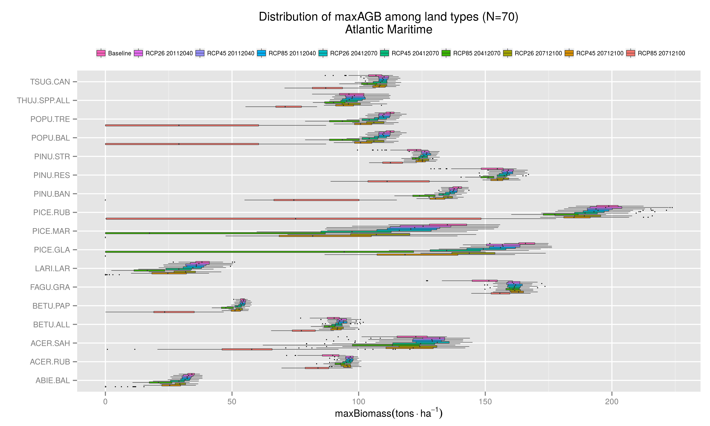
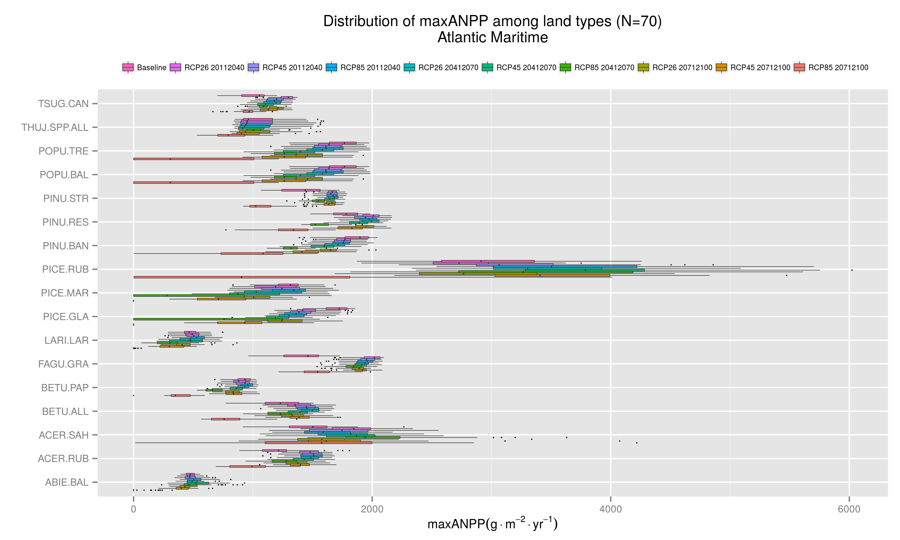
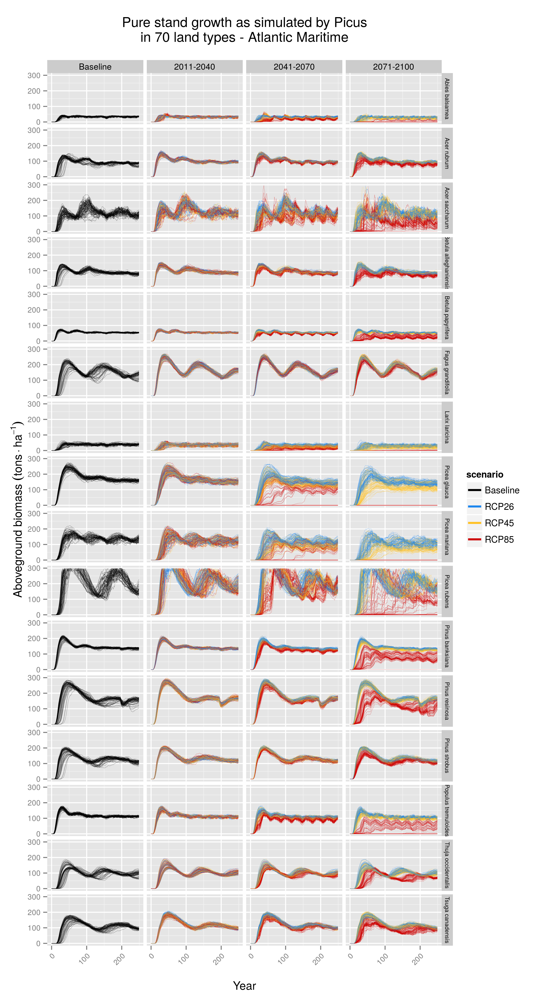

Updated on `r format(Sys.time(), "%b %d %Y")`

-------

```{r, echo=FALSE}
a <- "AM"
```


```{r packageLoadingChunk, include=FALSE}
require(RCurl)
#require(raster)
#require(maptools)
#require(rgdal)
#require(ggmap)
#require(dismo)
#require(rgeos)
#require(plyr)
```


```{r loadingTables, echo=FALSE}
readURL <- "https://raw.githubusercontent.com/dcyr/LANDIS-II_IA_generalUseFiles/master/"
vegCodes <- read.csv(text = getURL(paste(readURL, "vegCodes.csv", sep="/")))
ecozones <- read.csv(text = getURL(paste(readURL, "ecoNames.csv", sep="/")))
simAreaName <- ecozones[ecozones$code==a,"name"]

```


### Landis-II - Biomass succession - Dynamic inputs

The following three figures show how parameter values derived from Picus outputs are distributed among land types for maximum aboveground biomass (**maxAGB**), maximum annual net primary productivity (**maxANPP**), and species establishment probabilities (**SEP**) are distributed. Those parameters are called *dynamic inputs* because they can vary through the course of one simulation, to account for the effect of climate change, for instance.

Much of the succession dynamics simulated by LANDIS-II depends from those values, in interaction with landscape configuration, initial conditions, disturbances and static species parameters such as longevity, seed dispersal distances, etc.

-------




-------




-------


-------

### Picus raw outputs


The following figure illustrates Picus outputs for each species and all land types. The parameter values illustrated above are directly derived from those simulation outputs, and translated into 

More details available [here](https://github.com/dcyr/PicusToLandisIIBiomassSuccession)

Simulations are started from bare ground, allowing only one species at the time and are ran for 250 years.



